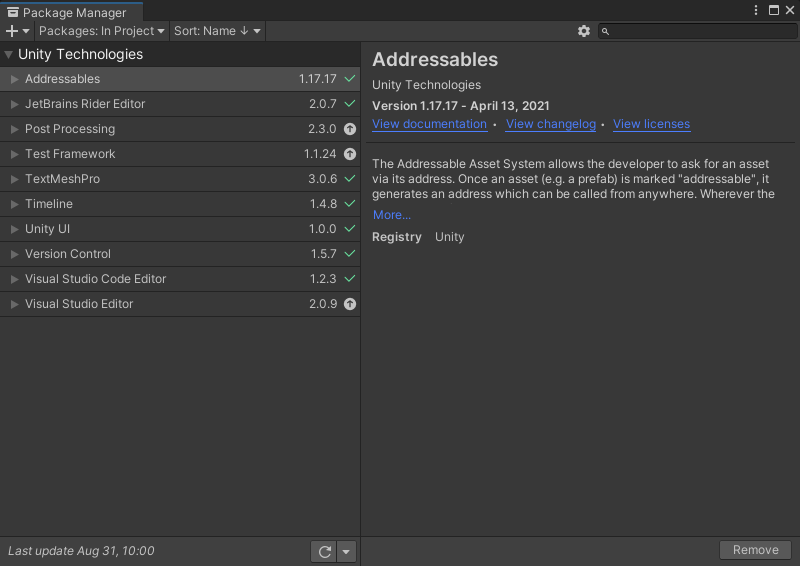

## Unity Editor 创建一个独立的编辑器窗口

```c#

using System.Collections;
using System.Collections.Generic;
using UnityEngine;
using UnityEditor;
 
//窗口类需要继承自EditorWindow
public class MyWindow : EditorWindow
{
    string myString = "Hello World";
    bool groupEnabled;
    bool myBool = true;
    float myFloat = 1.23f;
 
    //窗口需要一个打开的方式
    //MenuItem属性会在编辑器菜单上创建对应的选项
    //点击选项即可创建窗口
    [MenuItem("Window/My Window")]
    public static void ShowWindow()
    {
        //调用EditorWindow的静态函数GetWindow
        //创建对应的窗口
        //ps:该函数有多个重载
        EditorWindow.GetWindow(typeof(MyWindow));
    }
 
    private void OnGUI()
    {
        //窗口绘制的实际代码在这里
        GUILayout.Label("Base Settings", EditorStyles.boldLabel);
        myString = EditorGUILayout.TextField("TextField", myString);
        groupEnabled = EditorGUILayout.BeginToggleGroup("Optional Settings", groupEnabled);
        myBool = EditorGUILayout.Toggle("Toggle", myBool);
        myFloat = EditorGUILayout.Slider("Slider", myFloat, -3, 3);
        EditorGUILayout.EndToggleGroup();
    }
}
```

原文链接：https://blog.csdn.net/qq_14812585/article/details/107875119

## 编辑器扩展 序列化

官方定义,序列化就是将数据结构或对象状态转换成可供Unity保存和随后重建的自动化处理过程 。

自动触发序列化

- 文件的保存/读取，包括Scene、Asset、AssetBundle，以及自定义的ScriptableObject等。
- Inspector窗口
- 编辑器重加载脚本脚本
- Prefab
- Instantiation

相关链接1:https://zhuanlan.zhihu.com/p/29357313

ISerializationCallbackReceiver

官方文档:https://docs.unity3d.com/cn/2021.1/ScriptReference/ISerializationCallbackReceiver.html


## 自定义编辑器 CustomEditor

为了加快应用程序开发，请为常用组件创建自定义编辑器

官方文档:https://docs.unity3d.com/cn/2020.2/Manual/editor-CustomEditors.html

### Unity编辑器扩展:IMGUI

所有关于 Editor 的相关 UI，包括 Inspector、Hierarchy、Window、Game 视图上动态创建的那些半透明 UI、还有 Scene 视图上可添加的辅助显示 UI，叫做 IMGUI，全称 `Immediate Mode GUI`。该名字来源于两类型的 UI 系统：`immediate` 和 `retained`。

“即时模式”GUI 系统（也称为 IMGUI）是一个完全独立的功能系统，不同于 Unity 基于游戏对象的主 UI 系统。IMGUI 是一个代码驱动的 GUI 系统，主要用作程序员的工具。为了驱动该系统，需在实现脚本上调用 `OnGUI()`函数。

Unity 的 IMGUI 控件使用一个名为 `OnGUI()` 的特殊函数。只要启用包含脚本，就会在每帧调用 `OnGUI()` 函数，就像 `Update()` 函数一样。

相关链接:https://www.e-learn.cn/topic/4112959

官方文档:https://docs.unity3d.com/cn/2020.2/Manual/GUIScriptingGuide.html

### GUILayout、EditorGUILayout

相关链接:https://blog.csdn.net/qq_38275140/article/details/84778344

### GUI与GUILayout与EditorGUI、EditorGUILayout

GUI类是固定布局，GUILayout类是自动布局。

EditorGUI、EditorGUILayout与GUI、GUILayout类似

相关链接:https://blog.csdn.net/qq_14812585/article/details/107887582

### GUI样式和GUI皮肤改变编辑器的外观和风格

GUIStyle  

GUIContent 

GUISkin 

GUILayoutOption

相关链接:https://blog.csdn.net/qq_14812585/article/details/107892472?spm=1001.2014.3001.5501

### EditorStyles

相关链接:https://blog.csdn.net/qq_14812585/article/details/107893165?spm=1001.2014.3001.5501

### 自定义Inspector面板

相关链接1:https://blog.csdn.net/qq_14812585/article/details/107892318?spm=1001.2014.3001.5501

[相关链接2](https://blog.csdn.net/tom_221x/article/details/79437561?ops_request_misc=%257B%2522request%255Fid%2522%253A%2522161698867116780255244326%2522%252C%2522scm%2522%253A%252220140713.130102334.pc%255Fall.%2522%257D&request_id=161698867116780255244326&biz_id=0&utm_medium=distribute.pc_search_result.none-task-blog-2~all~first_rank_v2~rank_v29-25-79437561.pc_search_result_no_baidu_js&utm_term=Unity+SerializedObject%E7%B1%BB)

#### Unity编辑器多对象编辑

相关属性:`CanEditMultipleObjects`

相关链接:https://blog.csdn.net/yupu56/article/details/53303900


#### Editor.OnInspectorGUI

**描述**

实现此函数以创建自定义检视面板。

在此函数中，可以为特定对象类的检视面板添加自己的基于 IMGUI 的自定义 GUI。 `DrawPropertiesExcluding(SerializedObject,string[])`绘制给定 `SerializedObject` 中的所有属性，不包括 `propertyToExclude ones.SerializedObject` 到不绘制的属性的 `draw.List`。

**注意**：此函数必须重载才能正常工作。


官方文档:https://docs.unity3d.com/cn/2020.2/ScriptReference/Editor.OnInspectorGUI.html


#### SerializedProperty和SerializedObject

`SerializedProperty`和`SerializedObject`类用于对象编辑器属性，是完全通用的方法，自动处理撤销和为预设的UI样式。

##### `SerializedProperty`序列化属性

常用属性:

- `boolValue / floatValue / doubleValue / intValue / vector3Value / rectValue`：为属性指定值；
- `name / propertyPath`：获取属性名/获取属性路径（两者常常相同）

[相关链接](https://blog.csdn.net/linuxheik/article/details/79064653?ops_request_misc=%257B%2522request%255Fid%2522%253A%2522161786958616780264053635%2522%252C%2522scm%2522%253A%252220140713.130102334.pc%255Fall.%2522%257D&request_id=161786958616780264053635&biz_id=0&utm_medium=distribute.pc_search_result.none-task-blog-2~all~first_rank_v2~rank_v29-4-79064653.pc_search_result_cache&utm_term=SerializedProperty&spm=1018.2226.3001.4187)

官方文档:https://docs.unity3d.com/cn/2020.2/ScriptReference/SerializedProperty.html

##### `SerializedObject`序列化对象

常用属性:

`targetObject/targetObjects`:返回一个或一组Object;

```C#
public Object targetObject;
```

常用方法:

- `FindProperty()`：根据名称查找对象中的序列化属性；如果不知道属性路径可以通过在属性面板上的相应变量上使用shift+右键可log路径名；（侧重于查找指定属性）

```c#
//方法
public SerializedProperty FindProperty(string propertyPath);
```

- `GetIterator`：获取第一个序列化属性，然后可以通过`SerializedProperty`的`Next()`方法遍历对象中的序列化属性；（侧重于遍历功能）

```
public SerializedProperty GetIterator();
```

- `ApplyModifiedProperties() / ApplyModifiedPropertiesWithoutUndo()`：将对属性的修改应用到该序列化对象上；

```c#
public bool ApplyModifiedProperties();
```

- `CopyFromSerializedProperty() / CopyFromSerializedPropertyIfDifferent()`：拷贝属性值；注意两者方法的区别，第二个如果进行拷贝操作则返回true；

```c#
//方法声明
public void CopyFromSerializedProperty(SerializedProperty prop);
public bool CopyFromSerializedPropertyIfDifferent(SerializedProperty prop);
```


相关链接:http://docs.manew.com/Script/SerializedObject.html

官方文档:https://docs.unity3d.com/cn/2020.2/ScriptReference/SerializedObject.html

#### serialzedObject和Editor.target(Editor.targets)

**类型** `serialzedObject` 为`SerialzedObject` 

​		`Editor.target`为`Object` 需强转为自定义编辑器作用的对象(脚本)

**官方文档相关描述**:

虽然您可以从对象的 API 角度通过这种方式来编辑对象(*使用`Editor.target`)，但您还必须使用其他编辑器 API 来指定哪些组件已脏化，以便此操作可以撤消，并在下次保存场景时此操作被检测为更改，诸如此类。相反，使用 SerializedObject 会自动处理此过程。可以撤消，并作为场景中的更改进行跟踪。

相关链接:https://stackoverflow.com/questions/55027410/editor-target-vs-editor-serializedobject

**理解**:  与CanEditMultipleObjects 的多对象编辑相关

serializadObject支持多对象编辑 Editor.target不支持 需使用Editor.targets

与直接修改脚本变量相比，使用SerializedObject和SerializedProperty系统进行编辑是有利的，因为这会自动处理**多对象编辑，撤消和Prefab覆盖**。

如果您不希望自动为您处理撤消，预制替代和多对象编辑功能，只需使用`Editor.target`或`Editor.targets`即可。如果您确实希望这些功能自动运行，请使用`SerializedObject`和`SerializedProperty`。

例 使用`Editor.targets`进行多对象处理直接对对象进行编辑未记录脏化

```c#
[CustomEditor(typeof(SineAnimation)),CanEditMultipleObjects]
public class SineAnimationEditor : Editor
{

    public override void OnInspectorGUI()
    {
        base.OnInspectorGUI();

        if (GUILayout.Button("Randomize Sine Function", EditorStyles.miniButton))
        {
            float period = Random.Range(0f, 10f);
            float amplitude = Random.Range(0f, 10f);
            float phaseShift = Random.Range(0f, 10f);

            foreach (var tg in targets)
            {
                SineAnimation sineAnimation = tg as SineAnimation;
                sineAnimation.period = period;
                sineAnimation.amplitude = amplitude;
                sineAnimation.phaseShift = phaseShift;
            }
        }
    }
}
```

例 使用`serialzedObject`进行编辑 自带多对象处理 并记录脏化

```c#
[CustomEditor(typeof(SineAnimation)),CanEditMultipleObjects]
public class SineAnimationEditor : Editor
{

    public override void OnInspectorGUI()
    {
        base.OnInspectorGUI();
        if (GUILayout.Button("Randomize Sine Function", EditorStyles.miniButton))
        {
            serializedObject.FindProperty("m_Period").floatValue = Random.Range(0f, 10f);
            serializedObject.FindProperty("m_Amplitude").floatValue = Random.Range(0f, 10f);
            serializedObject.FindProperty("m_PhaseShift").floatValue = Random.Range(0f, 1f);
            serializedObject.ApplyModifiedProperties();
        }
    }
}
```

### Scene视图拓展

可以通过在自定义编辑器中实现 OnSceneGUI 来向 Scene 视图添加额外代码。

#### Editor.OnSceneGUI

OnSceneGUI 的运行方式很像 OnInspectorGUI - 只不过在 Scene 视图中运行而已。为了方便在 Scene 视图中创建自己的编辑控件，可以使用在 [Handles](https://docs.unity.cn/cn/current/ScriptReference/Handles.html) 类中定义的函数。其中的所有函数都是为 3D 模式的 Scene 视图设计的。

相关链接:https://www.xuanyusong.com/archives/2303

相关链接:https://blog.csdn.net/wangjiangrong/article/details/80053893

[官方文档](https://docs.unity3d.com/cn/2020.2/ScriptReference/Editor.OnSceneGUI.html)

### ReorderableList可拖动列表

`UnityEditorInternal`命名空间下提供一个类`ReorderableList`可以实现通过拖拽来达到

列表元素的重新排序。

基本方法：
名称 描述
draggable 拖曳排序
displayAdd 显示添加按钮
displayRemove 显示移除按钮
elementHeight 元素高度
headerHeight 表头高度
footerHeight 尾部高度
showDefaultBackground 显示默认背景
drawHeaderCallback 绘制表头回调
drawFooterCallback 绘制尾部回调
drawElementCallback 绘制元素回调
drawElementBackgroundCallback 绘制元素背景回调
onReorderCallback 重新排序回调
onSelectCallback 选中回调
onAddCallback 添加按钮回调
onAddDropdownCallback 添加下拉选项回调
onRemoveCallback 移除元素回调
onMouseUpCallback 鼠标抬起回调
onCanRemoveCallback 是否显示可移除按钮回调
onChangedCallback 列表改变回调

相关链接:https://blog.csdn.net/qq_14812585/article/details/107900050?spm=1001.2014.3001.5501

简单使用实例:https://blog.csdn.net/qq_26999509/article/details/77782177

复杂使用实例:https://blog.csdn.net/qq_26999509/article/details/77801852

介绍 https://va.lent.in/unity-make-your-lists-functional-with-reorderablelist/

### GenericMenu选项菜单

GenericMenu允许创建自定义上下文菜单和下拉菜单,您可以通过该菜单更改应用于窗口中 GUI 的颜色。

官方文档:https://docs.unity3d.com/cn/2020.2/ScriptReference/GenericMenu.html

### EditorUtility 、GUIUtility、EditorGUIUtility、GUILayoutUtility

各方法变量API总览 https://blog.csdn.net/qq_14812585/article/details/107932567?spm=1001.2014.3001.5501

#### EditorUtility

[相关链接](https://blog.csdn.net/qq_33337811/article/details/65002906)


DisplayProgressBar 进度条

 [相关链接1](https://blog.csdn.net/LIQIANGEASTSUN/article/details/42174339/) [相关链接2](https://blog.csdn.net/linxinfa/article/details/86588972)


DisplayDialog 对话框

 [相关链接](https://blog.csdn.net/LIQIANGEASTSUN/article/details/42174671?ops_request_misc=%257B%2522request%255Fid%2522%253A%2522161828821616780269816146%2522%252C%2522scm%2522%253A%252220140713.130102334.pc%255Fblog.%2522%257D&request_id=161828821616780269816146&biz_id=0&utm_medium=distribute.pc_search_result.none-task-blog-2~blog~first_rank_v2~rank_v29-2-42174671.nonecase&utm_term=EditorUtility&spm=1018.2226.3001.4450)


DisplayPopupMenu  显示弹出菜单

 [相关链接](https://blog.csdn.net/LIQIANGEASTSUN/article/details/42174787?ops_request_misc=%257B%2522request%255Fid%2522%253A%2522161828821616780269816146%2522%252C%2522scm%2522%253A%252220140713.130102334.pc%255Fblog.%2522%257D&request_id=161828821616780269816146&biz_id=0&utm_medium=distribute.pc_search_result.none-task-blog-2~blog~first_rank_v2~rank_v29-3-42174787.nonecase&utm_term=EditorUtility&spm=1018.2226.3001.4450)


OpenFilePanel 显示“打开文件”对话框并返回所选的路径名称。

[官方文档](https://docs.unity.cn/cn/current/ScriptReference/EditorUtility.OpenFilePanel.html)

SaveFilePanel 显示“保存文件”对话框并返回所选的路径名称。

[官方文档](https://docs.unity.cn/cn/current/ScriptReference/EditorUtility.SaveFilePanel.html)


OnpenFolerPanel 显示“打开文件夹”对话框并返回所选的路径名称。

[官方文档](https://docs.unity.cn/cn/current/ScriptReference/EditorUtility.OpenFolderPanel.html)


SaveFolderPanel  显示“保存文件夹”对话框并返回所选的路径名称。

[官方文档](https://docs.unity.cn/cn/current/ScriptReference/EditorUtility.SaveFolderPanel.html)


CollectDeepHiearachy 遍历对象以及子物体,以及子物体上绑定的所有组件 

[相关链接](https://blog.csdn.net/LIQIANGEASTSUN/article/details/42174585?ops_request_misc=%257B%2522request%255Fid%2522%253A%2522161828821616780269816146%2522%252C%2522scm%2522%253A%252220140713.130102334.pc%255Fblog.%2522%257D&request_id=161828821616780269816146&biz_id=0&utm_medium=distribute.pc_search_result.none-task-blog-2~blog~first_rank_v2~rank_v29-1-42174585.nonecase&utm_term=EditorUtility&spm=1018.2226.3001.4450)


CreateGameObjectWithHideFlags  使用 HideFlags 和指定组件创建游戏对象。

这与按常规方式创建 GameObject 非常类似，区别在于它 会立即设置指定的 HideFlags。(HideFlags 位掩码，用于控制对象的销毁、保存和在 Inspector 中的可见性。[文档](https://docs.unity.cn/cn/current/ScriptReference/HideFlags.html))

[相关链接](https://blog.csdn.net/LIQIANGEASTSUN/article/details/42174625?ops_request_misc=%257B%2522request%255Fid%2522%253A%2522161828821616780269816146%2522%252C%2522scm%2522%253A%252220140713.130102334.pc%255Fblog.%2522%257D&request_id=161828821616780269816146&biz_id=0&utm_medium=distribute.pc_search_result.none-task-blog-2~blog~first_rank_v2~rank_v29-10-42174625.nonecase&utm_term=EditorUtility&spm=1018.2226.3001.4450)


CompressTexture 压缩一个纹理到指定的格式

 [相关链接](https://blog.csdn.net/LIQIANGEASTSUN/article/details/42174585?ops_request_misc=%257B%2522request%255Fid%2522%253A%2522161828821616780269816146%2522%252C%2522scm%2522%253A%252220140713.130102334.pc%255Fblog.%2522%257D&request_id=161828821616780269816146&biz_id=0&utm_medium=distribute.pc_search_result.none-task-blog-2~blog~first_rank_v2~rank_v29-1-42174585.nonecase&utm_term=EditorUtility&spm=1018.2226.3001.4450)


FocusProjectWindow  将 Project 窗口置于前面并聚焦该窗口。通常，系统调用用于创建和选择资源的菜单项之后，会调用此函数

[相关链接](https://blog.csdn.net/LIQIANGEASTSUN/article/details/42174829?ops_request_misc=%257B%2522request%255Fid%2522%253A%2522161828821616780269816146%2522%252C%2522scm%2522%253A%252220140713.130102334.pc%255Fblog.%2522%257D&request_id=161828821616780269816146&biz_id=0&utm_medium=distribute.pc_search_result.none-task-blog-2~blog~first_rank_v2~rank_v29-5-42174829.nonecase&utm_term=EditorUtility&spm=1018.2226.3001.4450)


#### GUIUtility

用于创建新 GUI 控件的 Utility 类。

除非您从头开始创建自己的 GUI 控件，否则不应使用这些函数。

[官方文档](https://docs.unity.cn/cn/current/ScriptReference/GUIUtility.html)

#### EditorGUIUtility

EditorGUI 的各种辅助程序。

[官方文档](https://docs.unity.cn/cn/current/ScriptReference/EditorGUIUtility.html)

#### GUILayoutUtility

用于实现和扩展 GUILayout 类的实用函数。

使用该类创建您自己的 GUI 布局代码。

[官方文档](https://blog.csdn.net/qq_14812585/article/details/107932567?spm=1001.2014.3001.5501)

### PropertyAttribute

官方描述:

用于派生自定义属性特性的基类。这可用于为脚本变量创建特性。

自定义特性可以与自定义PropertyDrawer类连接,以控制具有该特性的脚本变量如何在Inspector中显示

简单理解:

继承PropertyAttribute这个类,便能用一个自定义的PropertyDrawer的类去控制继承ProeertyAttribute类的变量在Inspector面板中的显示

[相关链接](https://blog.csdn.net/qq_33337811/article/details/66475651)

### PropertyDrawer属性绘制器

https://blog.csdn.net/qq_33337811/article/details/66475502

https://blog.csdn.net/qq_14812585/article/details/107933205?spm=1001.2014.3001.5501

CustomEditor CustomPropertyDrawer 区分使用  https://blog.csdn.net/linuxheik/article/details/88870418

## Gizmos辅助调试工具

Gizmos是Scene场景的可视化调试或辅助工具，可以通过两种方式实现。

OnDrawGizmos	OnDrawGizmosSelected	DrawGIzmos

https://blog.csdn.net/qq_35361471/article/details/84715008


## Hierarchy面板拓展

https://blog.csdn.net/qq_26999509/article/details/78006957


## Unity编辑器 - DragAndDrop拖拽控件

https://blog.csdn.net/acwk0442/article/details/101502125


## ScriptableWizard 编辑器向导

[官方文档](https://docs.unity.cn/cn/current/ScriptReference/ScriptableWizard.html)

开启新窗口

```c#
public class ProducerEditDialog : ScriptableWizard
{
    public bool isOK = false;
    private void OnGUI()
    {
        UIItemDatabase.Instance.producerIdsIndex = EditorGUILayout.Popup(UIItemDatabase.Instance.producerIdsIndex,UIItemDatabase.Instance.producerIds);

        if (GUILayout.Button("确认", GUILayout.Width(50)))
        {
            isOK = true;
            EditorWindow.FocusWindowIfItsOpen(typeof(ItemInfoEditor));
        }
    }
}
```

```c#
       public static ProducerEditDialog pdd;  


		if(GUILayout.Button("修改",GUILayout.Width(50)))
        {
            pdd= ScriptableWizard.DisplayWizard<ProducerEditDialog>("作者Id");          
            pdd.position = new Rect(position.x+250, position.y+100, 200, 100);
        }
```


[Unity编辑器扩展实践  通过代码查找所有预制](https://blog.csdn.net/qq_33461689/article/details/103773692)

[OnValidate](https://blog.csdn.net/piai9568/article/details/96645500)

[【编辑器】脚本实现OpenPrefab界面](https://blog.csdn.net/sinat_34870723/article/details/92832399)

[ H  面板相关编辑阶段  StageUtility](https://docs.unity3d.com/cn/2020.3/ScriptReference/SceneManagement.StageUtility.html)		[退出Prefab](https://www.cnblogs.com/zs3718/p/12487323.html)	[PrefabStageUtility  prefab相关](https://www.cnblogs.com/seeker4/p/13691658.html)


## 描述

## GL

[官方文档](https://docs.unity3d.com/cn/2020.2/ScriptReference/GL.html)

[csdn相关链接](https://blog.csdn.net/Htlas/article/details/79748512)


GUIStyle

各样式 https://blog.csdn.net/u011428080/article/details/106676213


[DecoratorDrawer](https://blog.csdn.net/YongshuangZhao/article/details/80225223)

[EditorGUIUtility.PingObject](https://www.baidu.com/s?ie=UTF-8&wd=unity%20PingObject) 

[Selection.activeGameObject](https://docs.unity.cn/cn/current/ScriptReference/Selection-activeGameObject.html) 

[UnityEditor 组合键](https://blog.csdn.net/li1164407295/article/details/84202214)	第二种 直接Event  control shift capsLock command 是否按住


[playModeStateChanged 编辑器Game播放模式变化](https://docs.unity.cn/cn/current/ScriptReference/EditorApplication-playModeStateChanged.html)

[预览内容绘制OnPreviewGUI](https://docs.unity.cn/cn/current/ScriptReference/Editor.OnPreviewGUI.html)

[DrawPreview](https://docs.unity.cn/cn/current/ScriptReference/Editor.DrawPreview.html)

[编辑器显示Preview](https://www.cnblogs.com/Csmiling/p/5997758.html)

{	Prefab

[EditorUtility.SaveFilePanelInProject  在项目的 Assets 文件夹中显示“保存文件”对话框并返回所选的路径名称。](https://docs.unity.cn/cn/current/ScriptReference/EditorUtility.SaveFilePanelInProject.html)

[PrefabUtility.SaveAsPrefabAsset](https://docs.unity.cn/cn/current/ScriptReference/PrefabUtility.SaveAsPrefabAsset.html)

}

{

Unity GUID

[[Unity文件、文件引用、meta详解](https://www.cnblogs.com/CodeGize/p/8697227.html)]

[Unity资源,对象和序列化(上)](https://www.cnblogs.com/zhaoqingqing/p/5823927.html)

[玩转Unity资源，对象和序列化(下)](https://www.cnblogs.com/zhaoqingqing/p/5825907.html)

[Unity GUID](https://blog.csdn.net/qq_37421018/article/details/98172662)

}


[Unity Component组件复制](https://blog.csdn.net/honey199396/article/details/78738691)

[Unity对象的所有组件深拷贝与粘贴](https://blog.csdn.net/weixin_30516243/article/details/99526652?utm_medium=distribute.pc_relevant.none-task-blog-2%7Edefault%7ECTRLIST%7Edefault-1.no_search_link&depth_1-utm_source=distribute.pc_relevant.none-task-blog-2%7Edefault%7ECTRLIST%7Edefault-1.no_search_link)

UnityEditorInternal命名空间


unity projector(阴影 投影)

[Unity AssetBundle	1](https://zhuanlan.zhihu.com/p/93199562)

[Unity AssetBundle	2](https://blog.csdn.net/qq_35361471/article/details/82854560)

[Unity Addressables 深入浅出(一)](https://zhuanlan.zhihu.com/p/244905174)	

https://www.zhihu.com/people/cheng-du-sao-ke-ke/posts

```c#
public class UnitInfo : ScriptableObject
{
    //public GameObject prefab;
    public GameObject Prefab
    {
        get
        {
            GameObject prefab = (GameObject)PrefabReference.Asset;
            if (prefab == null)
            {
                if (PrefabReference != null)
                {
                    var handle = PrefabReference.LoadAssetAsync<GameObject>();
                    prefab = handle.WaitForCompletion();
                }
            }

            return prefab;
        }
    }

    public AssetReference PrefabReference;
```

[Unity资源管理](https://zhuanlan.zhihu.com/p/34679893)


[UnityEvent 和 C# event 的差异与选择](https://blog.dctewi.com/post/unityevent-vs-csharpevent/)

[Unity 新 InputSystem](https://zhuanlan.zhihu.com/p/106396562)

[unity系统内置图标](https://www.xuanyusong.com/archives/3777/comment-page-1)

[Unity所有自带style和icon](https://blog.csdn.net/qq_33337811/article/details/74012108)

unity 网站:https://edu.51cto.com/courselist/126.html

UWA学堂:https://edu.uwa4d.com/

编辑器扩展:https://edu.51cto.com/course/15484.html


[.gitignore忽略规则](https://www.cnblogs.com/wzjwffg/p/9884042.html)

[.gitignore   GitHub所有ignore](https://github.com/github/gitignore)

[Typora相关设置](https://zhuanlan.zhihu.com/p/71600196)

[Typora  GitHub](https://www.bilibili.com/read/cv2230341/)	+ https://blog.csdn.net/qq_38056704/article/details/84765586

[GitHub](https://www.jianshu.com/p/296d22275cdd)

[Github 生成SSH秘钥](https://blog.csdn.net/qq_35495339/article/details/92847819)


[C#反射](https://blog.csdn.net/weixin_30834783/article/details/95391126)

[C#用反射获取类中的方法](https://blog.csdn.net/weixin_43935474/article/details/103290114?utm_medium=distribute.pc_relevant_t0.none-task-blog-2%7Edefault%7EBlogCommendFromMachineLearnPai2%7Edefault-1.control&dist_request_id=1331647.20776.16184506581230963&depth_1-utm_source=distribute.pc_relevant_t0.none-task-blog-2%7Edefault%7EBlogCommendFromMachineLearnPai2%7Edefault-1.control)

[C# 反射，通过类名、方法名调用方法](https://www.cnblogs.com/coderJiebao/p/CSharp09.html)

[C#GetHashCode](https://zhuanlan.zhihu.com/p/87291534)      https://blog.csdn.net/cnhk1225/article/details/23391885

[Unity 3D 监听资源创建 删除 移动 保存等事件](https://blog.csdn.net/songhuanfei2017/article/details/102456281/)

[JsonUtility](https://gameinstitute.qq.com/community/detail/128931)

[unity萌新的游戏开发之路知乎专栏](https://www.zhihu.com/column/c_1134472253415698432)

浏览器插件 dark reader		adblock

[itzy](https://page.hideu.live/)

[unity 2d光照](https://www.gameres.com/847306.html)

https://tieba.baidu.com/p/6908597952

[unity2d动作](https://mp.weixin.qq.com/s?__biz=MzU5MjQ1NTEwOA==&mid=2247496117&idx=1&sn=90a0b2f03cba36d5a8488b10ae84bac7&chksm=fe1dc51ec96a4c085469ddf27f3ff6446c77b618c00a191751889bcd83416569d93fca21a3f2&mpshare=1&scene=1&srcid=12235zHDsYkxrfxF7poCKBbU#rd)

[格斗游戏](https://www.zhihu.com/question/40969731)

[动作游戏伤害](https://bbs.gameres.com/thread_657016.html)

[unity性能优化工具](https://zhuanlan.zhihu.com/p/39529241?from_voters_page=true)

[unity性能优化cpu](https://zhuanlan.zhihu.com/p/39998137)

[unity性能优化渲染](https://zhuanlan.zhihu.com/p/40900056?ivk_sa=1024320u)

[unity相关](https://www.zhihu.com/people/etnly/posts)


[.NET软件开发与常用工具清单](https://www.cnblogs.com/SavionZhang/p/4033288.html)

[.Net Reflector反编译工具](https://www.jb51.net/softs/629309.html#downintro2)

[ILSpy和Reflector](https://blog.csdn.net/niuge8905/article/details/78363587)

[ILSpy](https://blog.csdn.net/testcs_dn/article/details/50491440)


 [A*Pathfinding](https://zhuanlan.zhihu.com/p/69593821)


[NavMeshSurface2dBaker](https://github.com/sharlatany/navmeshsurface2dbaker)

[NavMeshSurface](https://github.com/Unity-Technologies/NavMeshComponents)

[NavMeshPlus](https://github.com/h8man/NavMeshPlus)

[天地劫战棋制作](https://edu.manew.com/goods/show/485)

[unity2d书](https://www.jb51.net/books/552397.html)

[编程命名规范](https://zhuanlan.zhihu.com/p/89909623)

[Unity exe打包安装包](https://wenku.baidu.com/view/a599694e974bcf84b9d528ea81c758f5f71f297a.html)

[Unity提取游戏资源工具](http://www.xuanyusong.com/archives/3618)

​			https://blog.csdn.net/kenkao/article/details/89957778


[深圳东方](https://tieba.baidu.com/p/6908597952?pn=1)

unity 2020.1.17

